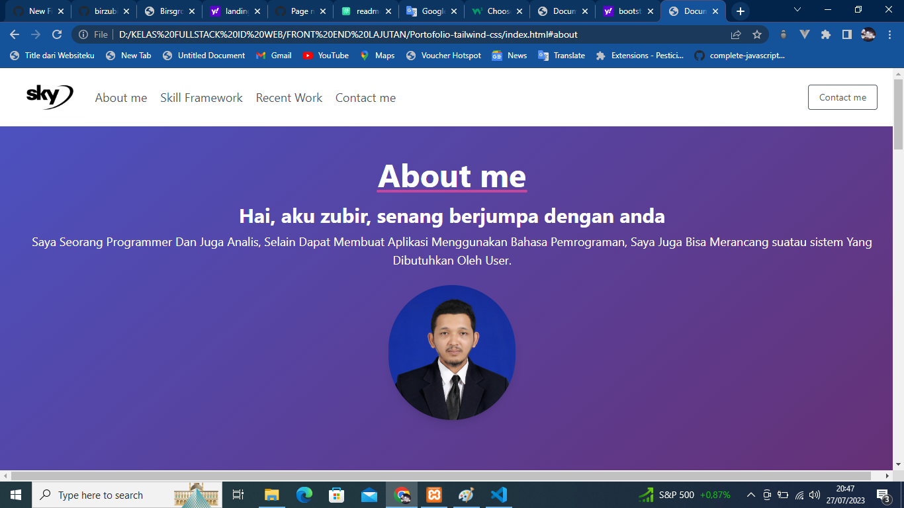
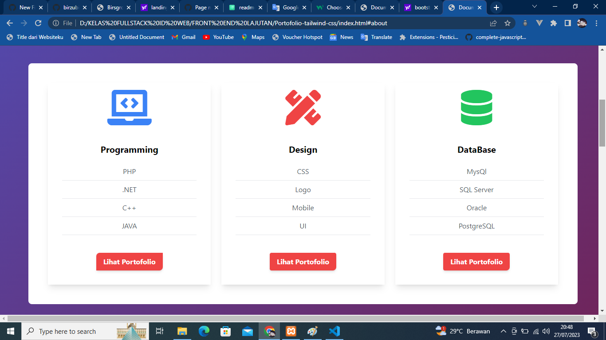
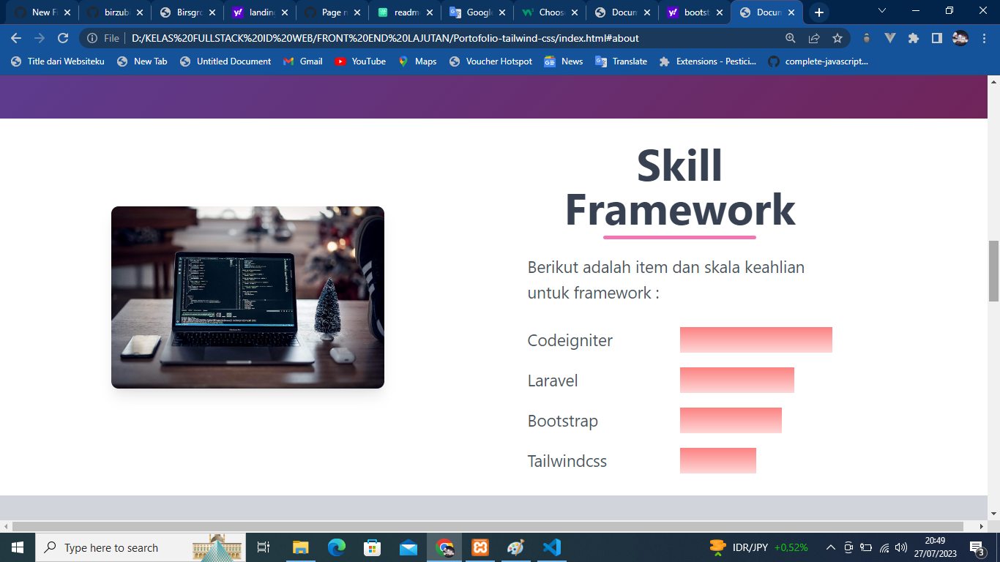
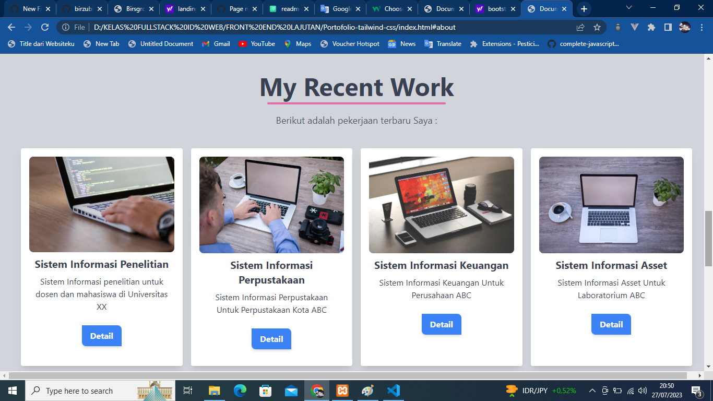

# HTML

https://www.w3schools.com/html/default.asp

# CSS

https://www.w3schools.com/css/default.asp

# bootstrap 5

https://getbootstrap.com/docs/5.2/getting-started/introduction/

# tailwindcss

https://tailwindcss.com/docs/installation

## Screenshots

## Screenshots

## Screenshots

## Screenshots

